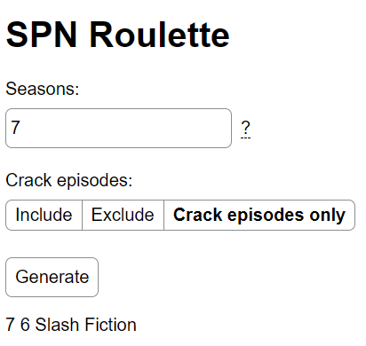
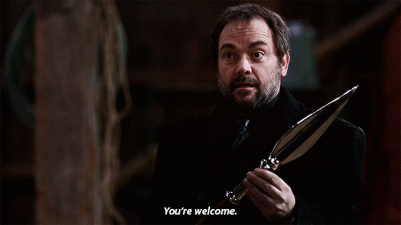

# Supernatural Roulette

[About](#about) ◈ [Features](#features) ◈ [Installation](#installation) ◈ [How to use](#how-to-use)

## About

Have you ever wanted to reminisce the 2000's with an episode from the Tumblr-famous Supernatural? You're in the right place! Supernatural Roulette is a random episode generator for the CW series Supernatural (2005-2020), with options to generate from certain seasons and to include/exclude "crack" (meta) episodes.

## Installation

### Windows

1. Create a virtual environment

    `python -m venv <name of environment>`

2. Download source code as a .zip
3. Unzip it into the folder with virtual environment
4. Install required packages from *requirements.txt*

    `pip install -r requirements.txt`

## How to use

1. Run *app.py* (Flask should automatically detect it)

    `python -m flask run`

2. Go to the local server/port using your browser
3. [Optional] Select the seasons to include by entering them in the box

    - Indicate separate seasons with a comma (`,`) and indicate ranges with a hyphen (`-`). **Do not use spaces**. For example, seasons 1 to 5, 8, and 10 to 13 would be entered as `1-5,8,10-13`

4. [Optional] Select option for "crack" episodes by clicking on the buttons

    - `Include` means all episodes, including "crack" ones, will be included

    - `Exclude` means only **non**-"crack" episodes will be included

    - `Crack episodes only` means only "crack" episodes will be included

5. Click "Generate". The generated episode will appear below, in the format `<season number> <episode number> <episode name>`
6. Click "Generate" again to re-generate with the same filters, or modify the filters and click "Generate" again

## Features

- **Filter by season:** Choose specific seasons to include in the randomization; all others will be excluded
- **Filter "crack" episodes:** Choose to include, exclude, or only randomize from the meta episodes. A list of crack episodes can be found in *files* > *episodes-crack.txt*

